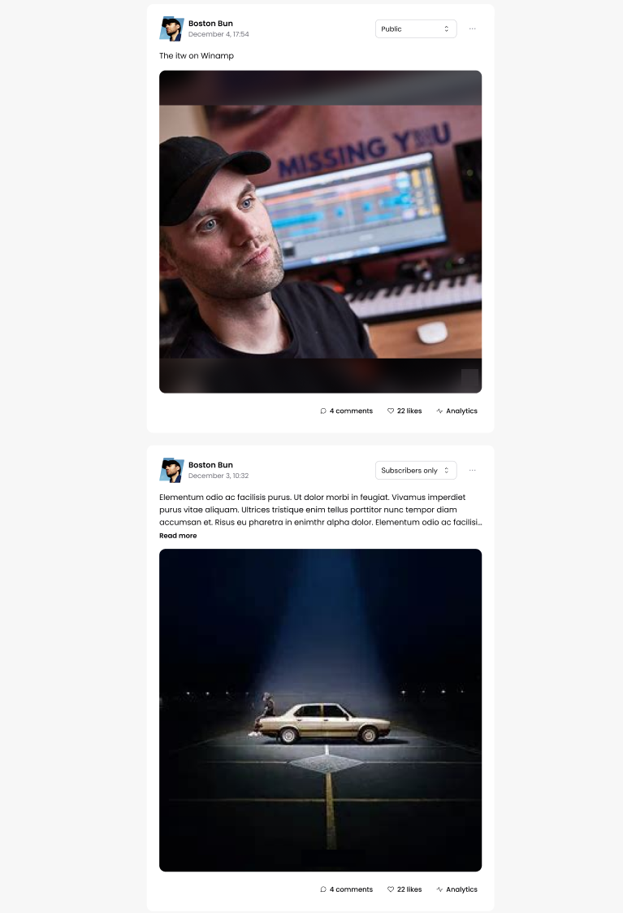

# Winamp social Feed

Welcome to the Winamp Front-end test! This test is designed to evaluate your skills in front-end development.
You will be building the feed page of the Winamp Social Network using TypeScript, React and TailwindCSS.

## Pre-requisites

- [Node.js](https://nodejs.org/en) (LTS version)
- [pnpm](https://pnpm.io/fr/installation)

## Getting Started

1. Clone this repository
2. Checkout to a new branch with your name
3. Run `pnpm install`
4. Run `pnpm dev` and open [http://localhost:3000](http://localhost:3000) with your browser.

## Project Structure

There are two main folders in this project, which are both ran by the same `pnpm dev` command:

- client: Contains the React application
- server: Contains a simple Express server that serves the feed data

You will only need to work on the client folder, but you will need to fetch the data from the only endpoint available in the server: `/social-posts`.

The server is configured on the same port as the react application, so you can fetch the data from `http://localhost:3000/social-posts`.

## Requirements

- [ ] Implement the feed page layout as shown in the design file
- [ ] Fetch the feed data from the provided API

## Design

You can find the design below or in the `public` folder. Not everything should be implemented, for example:

- You can add a dropdown for the Public or Premium tier, but you don't need to implement the functionality.
- The three dots in the top corner can be a disabled button
- You can display the number of likes and comments, but these should not be clickable. Same thing for analytics.

## Submission

When you are done, please push your branch to this repository and let us
know that you are done. We will take a look at your code and get back to you as soon as possible.
